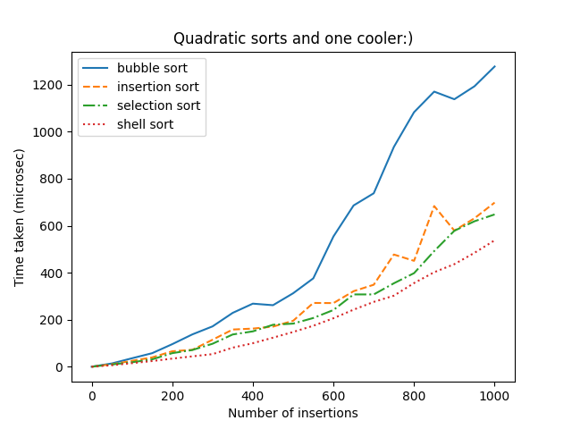
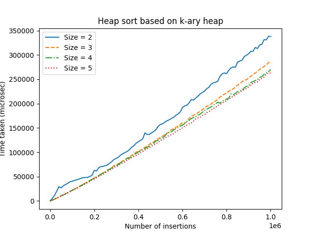
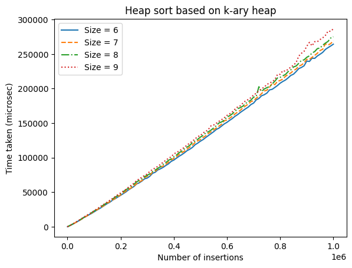
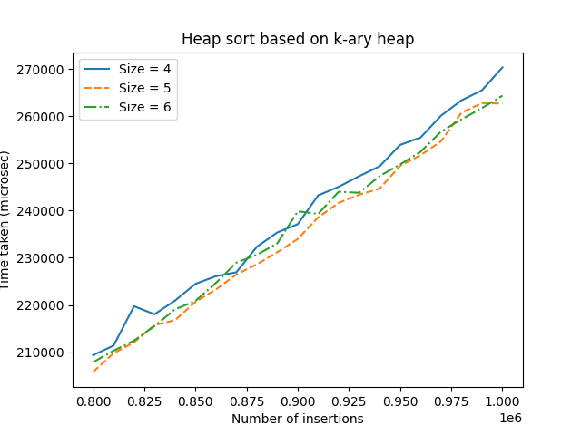

<h1 align="center">Привет, я <a href="https://t.me/Chin_chinless" target="_blank">Олег</a>
</h1>
<h4 align="center">Я автор лабораторной работы №3</h4>

# Тема: 
Сравнение различных сортировок

# Цель:
Реализовать различные версии сортировок массивов, измерить время их работы и узнать, какая из них работает быстрее библиотечной.

# Содержание:

1.  [Подготовка тестов для замеров времени](#подготовка-тестов-для-замеров-времени)
    1. [Оборудование для тестов](#оборудование-для-тестов)
    2. [Описание тестов](#описание-тестов)
2.  [Квадратичные сортировки](#квадратичные-сортировки)
3.  [Пирамидальная сортировка](#пирамидальная-сортировка)
4.  [Сортировка слиянием](#сортировка-слиянием)
5.  [Быстрая сортировка](#быстрая-сортировка)
    1.  [Выбор лучшего разбиения](#выбор-лучшего-разбиения)
    2.  [Выбор лучшего опорного элемента](#выбор-лучшего-опорного-элемента)
6.  [Выбор размера блока для IntroSort](#выбор-размера-блока-для-introsort)
7.  [Introspective sorting](#introspective-sorting)
8.  [Сортировки, основанные не на сравнениях](#сортировки-основанные-не-на-сравнениях)
9.  [Вывод](#вывод)

# Подготовка тестов для замеров времени

### Оборудование для тестов

**Процессор**: AMD Ryzen 7 5800H 3.22 Ghz
**ОЗУ**: 16 Гб
**ОС**: Linux Ubuntu 22.04.4 LTS
**Компилятор**: cc (Ubuntu 11.4.0-1ubuntu1~22.04) 11.4.0

### Описание тестов

Создание тестов при скачивании данного проекта запускается с помощью команды `make test_generate`. makefile создает исполняемый файл `create_random_array.exe`, он создает массив случайных чисел и записывает в файл: "<папка_с_тестами/число1_число2.in>", а также создает файл `qsort_random_array.exe`, этот файл с помощью встроенной в Си сортировки сортирует массив из файла с расширением .in и переписывает его отсортированный вид в файл .out. Ниже можно прочитать про различные папки с тестами.

1. very_small_tests
В данной папке будут находиться тесты с массивами размерами от 1 до 150 с шагом 1, ограничение MAX_RAND, тестов каждого размера 5.

2. small_tests
В данной папке будут находиться тесты с массивами размерами от 0 до 1000 с шагом 50, ограничение MAX_RAND, тестов каждого размера 5.

3. big_tests
В данной папке будут находиться тесты с массивами размерами от 0 до 1000000 с шагом 10000, ограничение MAX_RAND, тестов каждого размера 1.

4. test_most_dublicates
В данной папке будут находиться тесты с массивами размерами от 0 до 1000000 с шагом 10000, ограничение 10000, тестов каждого размера 1.

Перед проверкой замерами времени сортировок необходимо создать тесты.

# Квадратичные сортировки

В данном тестировании будут рассматриваться сортировки, работающие за $O(n^2)$, и сортировку Шелла, работающую за $O(n^{\frac{4}{3}})$ и в худшем случае $O(n^{\frac{3}{2}})$.

1. Сортировка пузырьком. Пусть $N$ - длина массива. Сортировка пузырьком заключается в том, что мы просто $N$ раз пройдемся по массиву и будем менять два соседних элемента, если первый больше второго. 

2. Сортировка выбором. Чтобы отсортировать массив, нужно просто $N$ раз выбрать минимум среди еще неотсортированных чисел. То есть на $i$-ом шаге ищется минимум на отрезке $[i, n-1]$, и этот минимум меняется с $i$-ым элементом, теперь отрезок $[0, i]$ отсортирован.

3. Сортировка вставками. Тогда пусть на $i$-ом шаге у нас уже будет отсортирован префикс до $i$-го элемента. Чтобы этот префикс увеличить, нужно взять элемент, идущий после него, и менять с левым соседом, пока этот элемент наконец не окажется больше своего левого соседа. Если в конце он больше левого соседа, но меньше правого - это значит, что мы правильно вставили этот элемент в отсортированную часть массива.

4. Сортировка Шелла. Алгоритм сортировки, являющийся усовершенствованным вариантом сортировки вставками. Идея метода Шелла состоит в сравнении элементов, стоящих не только рядом, но и на определённом расстоянии друг от друга. Иными словами — это сортировка вставками с предварительными «грубыми» проходами. 

**Итог**: Сортировка Шелла работает быстрее всех, что не удивительно, так как её асимптотика $O(n^{\frac{3}{2}}) в худшем случае, а остальные работают за $O(n^2)$.

# Пирамидальная сортировка

 Алгоритм сортировки, использующий структуру данных двоичная куча. Это неустойчивый алгоритм сортировки с временем работы $O(NlogN)$, где $N$ — количество элементов для сортировки, и использующий $O(1)$ дополнительной памяти.

 Про двоичную кучу можно прочитать по [ссылке](https://neerc.ifmo.ru/wiki/index.php?title=%D0%94%D0%B2%D0%BE%D0%B8%D1%87%D0%BD%D0%B0%D1%8F_%D0%BA%D1%83%D1%87%D0%B0). Однако, теперь проведём следующие тесты. Проверим какое количество детей в куче лучше всего использовать.

 

 

 

 **Итог**: Из графиков видно, что если в $k$-ичной куче $4 \leq k \leq 6$, то время сортировки минимально. В дальнейшем выберем $k=5$ для пирамидальной сортировки.

# Сортировка слиянием

# Быстрая сортировка

### Выбор лучшего разбиения

### Выбор лучшего опорного элемента

# Выбор размера блока для IntroSort

# Introspective Sorting

# Сортировки, основанные не на сравнениях

# Вывод