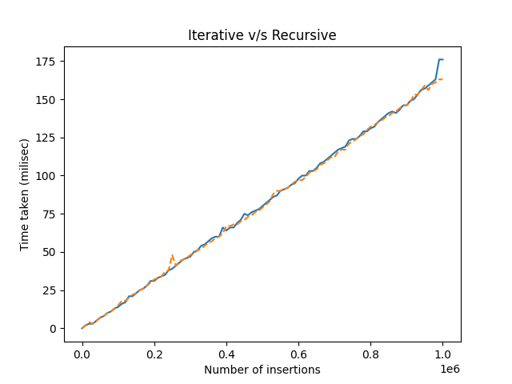
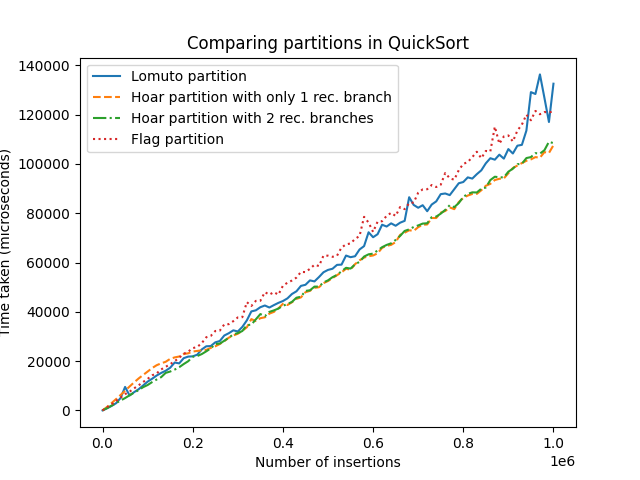
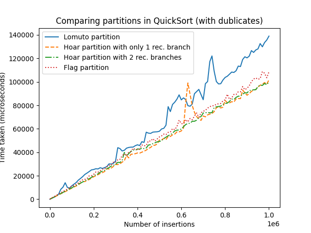
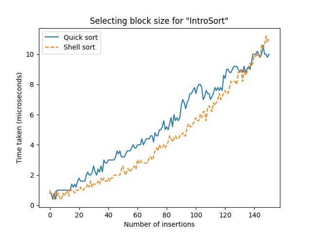
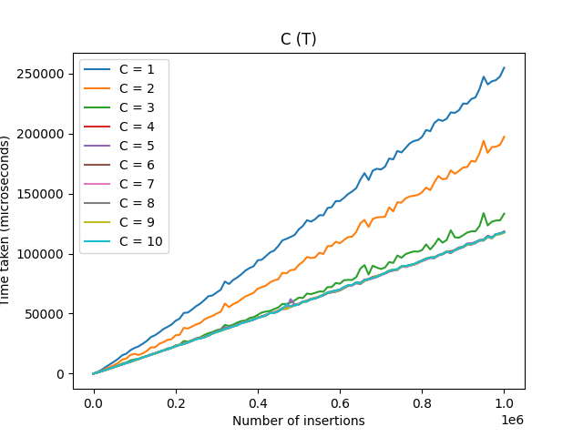
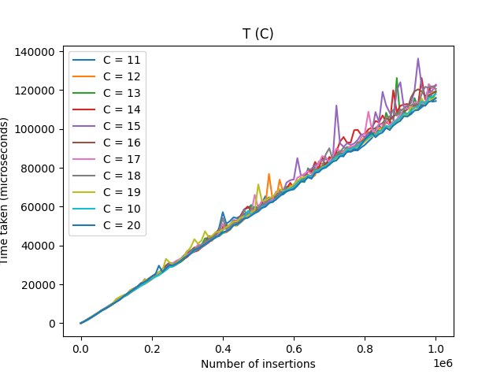
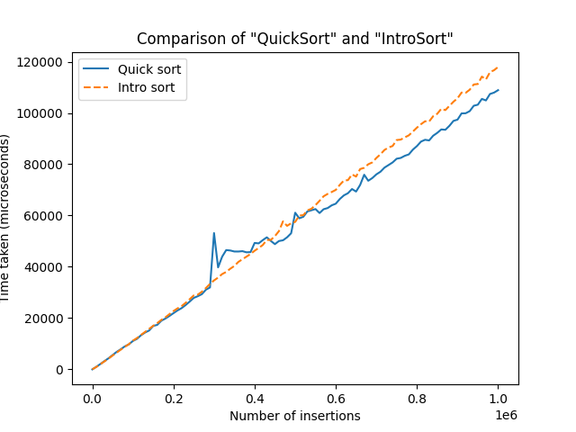
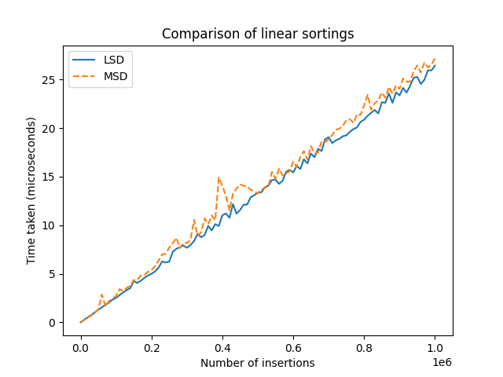
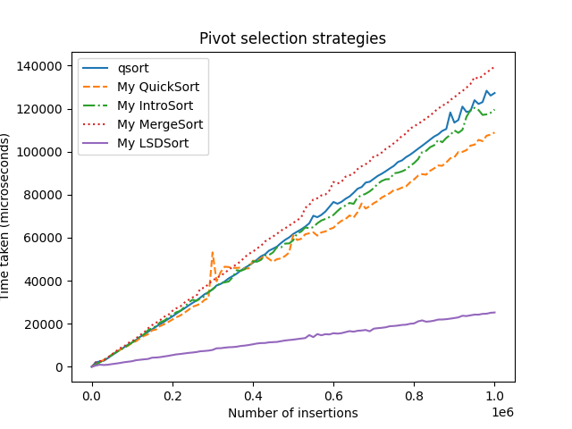

<h1 align="center">Привет, я <a href="https://t.me/Chin_chinless" target="_blank">Олег</a>
</h1>
<h4 align="center">Я автор лабораторной работы №3</h4>

# Тема: 
Сравнение различных сортировок

# Цель:
Реализовать различные версии сортировок массивов, измерить время их работы и узнать, какая из них работает быстрее библиотечной.

# Содержание:

1.  [Подготовка тестов для замеров времени](#подготовка-тестов-для-замеров-времени)
    1. [Оборудование для тестов](#оборудование-для-тестов)
    2. [Описание тестов](#описание-тестов)
2.  [Квадратичные сортировки](#квадратичные-сортировки)
3.  [Пирамидальная сортировка](#пирамидальная-сортировка)
4.  [Сортировка слиянием](#сортировка-слиянием)
5.  [Быстрая сортировка](#быстрая-сортировка)
    1.  [Выбор лучшего разбиения](#выбор-лучшего-разбиения)
    2.  [Выбор лучшего опорного элемента](#выбор-лучшего-опорного-элемента)
6.  [Выбор размера блока для IntroSort](#выбор-размера-блока-для-introsort)
7.  [Introspective sorting](#introspective-sorting)
8.  [Сортировки, основанные не на сравнениях](#сортировки-основанные-не-на-сравнениях)
9.  [Вывод](#вывод)

# Подготовка тестов для замеров времени

### Оборудование для тестов

**Процессор**: AMD Ryzen 7 5800H 3.22 Ghz
**ОЗУ**: 16 Гб
**ОС**: Linux Ubuntu 22.04.4 LTS
**Компилятор**: cc (Ubuntu 11.4.0-1ubuntu1~22.04) 11.4.0

### Описание тестов

Создание тестов при скачивании данного проекта запускается с помощью команды `make test_generate`. makefile создает исполняемый файл `create_random_array.exe`, он создает массив случайных чисел и записывает в файл: "<папка_с_тестами/число1_число2.in>", а также создает файл `qsort_random_array.exe`, этот файл с помощью встроенной в Си сортировки сортирует массив из файла с расширением .in и переписывает его отсортированный вид в файл .out. Ниже можно прочитать про различные папки с тестами.

1. very_small_tests
В данной папке будут находиться тесты с массивами размерами от 1 до 150 с шагом 1, ограничение MAX_RAND, тестов каждого размера 5.

2. small_tests
В данной папке будут находиться тесты с массивами размерами от 0 до 1000 с шагом 50, ограничение MAX_RAND, тестов каждого размера 5.

3. big_tests
В данной папке будут находиться тесты с массивами размерами от 0 до 1000000 с шагом 10000, ограничение MAX_RAND, тестов каждого размера 1.

4. test_most_dublicates
В данной папке будут находиться тесты с массивами размерами от 0 до 1000000 с шагом 10000, ограничение 10000, тестов каждого размера 1.

Перед проверкой замерами времени сортировок необходимо создать тесты.

# Квадратичные сортировки

В данном тестировании будут рассматриваться сортировки, работающие за $O(n^2)$, и сортировку Шелла, работающую за $O(n^{\frac{4}{3}})$ и в худшем случае $O(n^{\frac{3}{2}})$.

1. Сортировка пузырьком. Пусть $N$ - длина массива. Сортировка пузырьком заключается в том, что мы просто $N$ раз пройдемся по массиву и будем менять два соседних элемента, если первый больше второго. 

2. Сортировка выбором. Чтобы отсортировать массив, нужно просто $N$ раз выбрать минимум среди еще неотсортированных чисел. То есть на $i$-ом шаге ищется минимум на отрезке $[i, n-1]$, и этот минимум меняется с $i$-ым элементом, теперь отрезок $[0, i]$ отсортирован.

3. Сортировка вставками. Тогда пусть на $i$-ом шаге у нас уже будет отсортирован префикс до $i$-го элемента. Чтобы этот префикс увеличить, нужно взять элемент, идущий после него, и менять с левым соседом, пока этот элемент наконец не окажется больше своего левого соседа. Если в конце он больше левого соседа, но меньше правого - это значит, что мы правильно вставили этот элемент в отсортированную часть массива.

4. Сортировка Шелла. Алгоритм сортировки, являющийся усовершенствованным вариантом сортировки вставками. Идея метода Шелла состоит в сравнении элементов, стоящих не только рядом, но и на определённом расстоянии друг от друга. Иными словами — это сортировка вставками с предварительными «грубыми» проходами. 

Тестирование происходило на small_tests.


**Итог**: Сортировка Шелла работает быстрее всех, что не удивительно, так как её асимптотика $O(n^{\frac{3}{2}}) в худшем случае, а остальные работают за $O(n^2)$.

# Пирамидальная сортировка

 Алгоритм сортировки, использующий структуру данных двоичная куча. Это неустойчивый алгоритм сортировки с временем работы $O(NlogN)$, где $N$ — количество элементов для сортировки, и использующий $O(1)$ дополнительной памяти.

 Про двоичную кучу можно прочитать по [ссылке](https://neerc.ifmo.ru/wiki/index.php?title=%D0%94%D0%B2%D0%BE%D0%B8%D1%87%D0%BD%D0%B0%D1%8F_%D0%BA%D1%83%D1%87%D0%B0). Однако, теперь проведём следующие тесты. Проверим какое количество детей в куче лучше всего использовать.

 Тестирование происходило на big_tests.

 

 

 

 **Итог**: Из графиков видно, что если в $k$-ичной куче $4 \leq k \leq 6$, то время сортировки минимально. В дальнейшем выберем $k=5$ для пирамидальной сортировки.

# Сортировка слиянием

Алгоритм "MergeSort" использует принцип «разделяй и властвуй»: задача разбивается на подзадачи меньшего размера, которые решаются по отдельности, после чего их решения комбинируются для получения решения исходной задачи. Конкретно процедуру сортировки слиянием можно описать следующим образом:

Если в рассматриваемом массиве один элемент, то он уже отсортирован — алгоритм завершает работу.
Иначе массив разбивается на две части, которые сортируются рекурсивно.
После сортировки двух частей массива к ним применяется процедура слияния, которая по двум отсортированным частям получает исходный отсортированный массив.

Псевдокод слияния 2-ух массивов:
```
function merge(a : int[n]; left, mid, right : int):
    it1 = 0
    it2 = 0
    result : int[right - left]
  
    while left + it1 < mid and mid + it2 < right
        if a[left + it1] < a[mid + it2]
            result[it1 + it2] = a[left + it1]
            it1 += 1
        else
            result[it1 + it2] = a[mid + it2]
            it2 += 1
  
    while left + it1 < mid
        result[it1 + it2] = a[left + it1]
        it1 += 1
  
    while mid + it2 < right
        result[it1 + it2] = a[mid + it2]
        it2 += 1
  
    for i = 0 to it1 + it2
        a[left + i] = result[i]
```

Однако, стоит отметить, что алгоритм MergeSort можно реализовать итеративно. Рассмотрим время сортировок итеративной версии и рекурсивной версии сортировки слиянием:

Тестирование проходило на big_tests.



**Итог**: Конечно, по графику не так хорошо видно, что лучше, однако стоит отметить, что рекурсивная версия при очень больших данных может вызвать stack overflow, когда итеративная - нет, так как она не сильно нагружает стек программы. Поэтому стоит использовать итеративную версию в целях безопасности.

# Быстрая сортировка

Алгоритм сортировки:

1. Выбираем в массиве опорный элемент, назовем его *pivot*.
2. Разделяем массив так, чтобы все элементы в *array[0:x]* были меньше *pivot*, а в *array[x+1:n]* все элементы больше или равны *pivot*
3. Далее сортируем уже массив *array[0:x]* и *array[x+1:n]* по отдельности.

### Выбор лучшего разбиения

Для сортировки QuickSort было придумано много разбиений. Разберем 3 из них:

1. Разбиение Ломуто.
    1. Заведем 2 указателя l, r, изначально, оба показывают на начало массива.
    2. Пойдем слева направо, l - будет показывать границу, до которой все элементы $< pivot$.
    3. Таким образом для разбиения хватит 1 цикла.

    Пример кода:
``` C
static int LomutoPartition(int* const array, const int begin, const int end)
{
    int pivot = GetPivot(array, begin, end);

    int left_index = begin;

    Swap(array + end, array + begin + (end - begin) / 2);

    for (int right_index = begin; right_index <= end; ++right_index)
    {
        if (array[right_index] < pivot)
        {
            Swap(array + left_index, array + right_index);
            left_index++;
        }
    }

    Swap(array + end, array + left_index);

    return left_index;
}
```

2. Разбиение Хоара.
    1. Заведем 2 указателя l, r, левый начинает с начала, правый - с конца.
    2. Устремим их на встречу друг с другом.
    3. r пропускает все элементы $\geq pivot$, l пропускает все элементы $< pivot$. Когда оба находят элементы, стоящие не так, то меняют их местами
    4. Повторяем действия 1-3, пока l и r не встретятся. 

    Пример кода:
``` C
static void HoarPartition(int* const array, const int begin, const int end, const int pivot, int* const new_begin, int* const new_end)
{
    *new_begin  = begin;
    *new_end    = end;

    while ((*new_begin) <= (*new_end))
    {
        while (array[*new_begin] < pivot) { (*new_begin)++; }
        while (array[*new_end] > pivot)   { (*new_end)--; }

        if (*new_begin <= *new_end)
        {
            Swap(array + *new_begin, array + *new_end);
            (*new_begin)++;
            (*new_end)--;
        }
    }
}
```

3. Толстое разбиение или разбиение флагом Нидерландов.
    1. Заведем 3 указателя: l = 0, r = n - 1, mid = 0.
    2. Будем поддерживать следующий инвариант: все элементы в arr[r:n] $> pivot$, элементы в arr[0:l] $< pivot$ и элементы в arr[l:mid] $= pivot$.

    Пример кода:
``` C
static void FlagPartition(int* const array, int begin, int end, int* const equals_from, int* const equals_to)
{
    int pivot = GetPivot(array, begin, end);

    int middle = begin;

    while (middle <= end)
    {
        if (array[middle] < pivot)
        {
            Swap(array + begin, array + middle);
            begin++;
            middle++;
        } 
        else if (array[middle] == pivot)
        {
            middle++;
        }
        else
        {
            Swap(array + middle, array + end);
            end--;
        }
    }

    *equals_from = begin;
    *equals_to   = end;
}
```

Рассмотрев, теоретическую часть каждого разбиения, рассмотрим на их время работы:

Тестирование проводилось на big_tests и test_most_dublicates.




**Миниитог:** Из графиков видно, что во всех случаях лучше всего показывает разбиение Хоара. Будем использовать её в дальнейшем.

### Выбор лучшего опорного элемента

Рассмотрим, какой элемент нужно выбирать в качестве pivot.

1. Брать элемент из середины массива.
2. Брать медиану из начала, середины и конца массива.
3. Брать случайный элемент из массива.
4. Брать медиану из 3 случайных элементов.


**Минивывод:** Из графика видно, что брать в качестве pivot серединный элемент массива - это не лучшая идея, так могут быть сильные скачки, когда у других их поменьше. Так же медина 3 случайных элементов проигрывает по времени, так как слишком долго считает, но зато более стабильна в отличие от остальных. Остаются 2 претендента: медиана 3 элементов и случайный элемент. Я решил взять медиану 3 элементов.

# Выбор размера блока для IntroSort

Сама по себе сортировка IntroSort - это смесь всех сортировок и она использует все предыдущие сортировки и использует их в нужном случае. 
1 из них, это при очень маленьком размере выбирать квадратичные сортировки, а не быстрые, так как на маленьком объёме данных квадратичные эффективнее.
Найдем размер, когда квадратичные эффективнее:



**Промежуточный итог:** Из графика видно, что начиная с 132, время работы не так сильно различаются, а это значит, что в дальнейшей реализации IntroSort будем использовать данную константу.

# Introspective Sorting

IntroSort - это сортировка, которая в своей основе содержит быструю реализацию quicksort(quicksort с разбиением Хоара и медианой 3 элементов в качестве pivot), если размер массива не велик, то вызывает самую быструю квадратичную сортировку(ShellSort) и если глубина рекурсии > C*logN, то вызывает для сортировки HeapSort.

Пример кода:
``` C
static void IntroSort(int* const array, const int begin, const int end, const size_t depth_limit)
{
    assert((array != NULL) && "Pointer to \'array\' is NULL!!!\n");

    if (begin < end)
    {
        if (end - begin < BLOCK_SIZE_FOR_SHELL_SORT)
        {
            ShellSort(array + begin, end - begin + 1);
            return;
        }

        if (depth_limit == 0)
        {
            HeapSort(array + begin, end - begin + 1, NUMBER_OF_HEAP_CHILDREN);
            return;
        }

        int pivot       = _get_pivot(array, begin, end);
        int new_begin   = 0;
        int new_end     = 0;
        
        HoarPartition(array, begin, end, pivot, &new_begin, &new_end);

        if (begin < new_end)
        {
            IntroSort(array, begin, new_end, depth_limit - 1);
        }

        if (new_begin < end)
        {
            IntroSort(array, new_begin, end, depth_limit - 1);
        }
    }
}
```

Теперь проведем исследования, какая C должна быть в IntroSort: Тестирование на big_tests




Подводя итог, можно понять, что оптимальный $C \in [4, 16]$. Я выберу C = 16.
Рассмотрим, смогли ли мы обогнать qsort?
Тестирование на big_tests



**Итог:** QuickSort оказался быстрее, мне кажется, так получилось из-за постоянных дополнительных проверок, которые отнимали время работы.

# Сортировки, основанные не на сравнениях

Изначально мы обсуждали сортировки, которые сравнивают элементы друг с другом. Они имеют ограничение, они не могут работать быстрее $O(NlogN)$.
Однако, существуют 2 сортировки, которые основаны не на сравнениях, а на подсчётах чего-либо, например битов.

1. LeastSignificantDigitSort - псевдокод:
```
function radixSort(int[] A):
     for i = 1 to m               
         for j = 0 to k - 1                              
             C[j] = 0                                  
         for j = 0 to n - 1
             d = digit(A[j], i)
             C[d]++
         count = 0
         for j = 0 to k - 1
             tmp = C[j]
             C[j] = count
             count += tmp
         for j = 0 to n - 1
             d = digit(A[j], i)                             
             B[C[d]] = A[j]            
             C[d]++
         A = B
```

2. MostSignificantDigitSort  - псевдокод:
```
 function radixSort(int[] A, int l, int r, int d):
     if d > m or l >= r 
         return
     for j = 0 to k + 1 
         cnt[j] = 0
     for i = l to r                              
         j = digit(A[i], d)
         cnt[j + 1]++
     for j = 2 to k
         cnt[j] += cnt[j - 1]
     for i = l to r
         j = digit(A[i], d)
         c[l + cnt[j]] = A[i]
         cnt[j]--
     for i = l to r
         A[i] = c[i]
     radixSort(A, l, l + cnt[0] - 1, d + 1)
     for i = 1 to k
         radixSort(A, l + cnt[i - 1], l + cnt[i] - 1, d + 1)
```

Если что функция $digit(x,i)$ возвращает $i$-й разряд числа $x$.

Рассмотрим, какая из сортировок быстрее:



**Вывод:** Из графика видно, что LSD работает быстрее MSD, это не удивительно, так как LSD лучше подходит для целочисленных данных, в то время как в MSD нужно провести выравнивание, и она эффективнее работает на строках.

# Вывод

График всех самых быстрых функций:



По графику видно, что 3 мои реализации QuickSort, IntroSort и LeastSignificantDigitSort работают быстрее, чем библиотечная quicksort. Конечно, это не удивительно, так как qsort разработан для работы с разными объектами, а мы писали исключительно для чисел. Но в любом случае это говорит о том, что писать свои собственные сортировки нужно для быстрой работы своей програмыы.