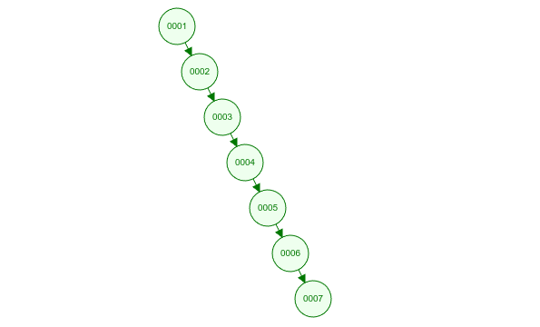
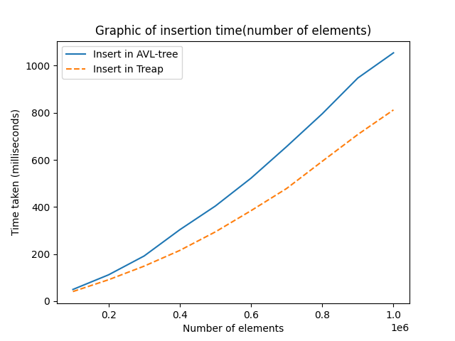
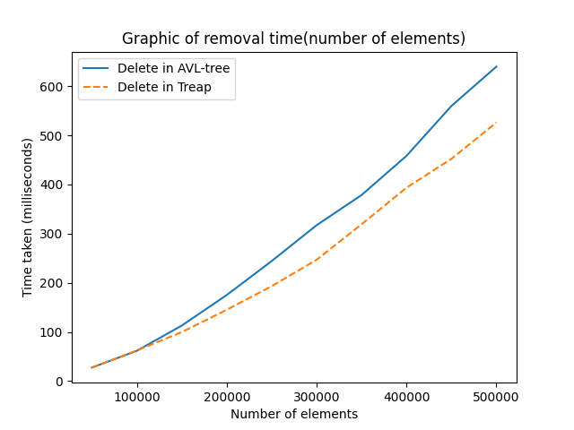
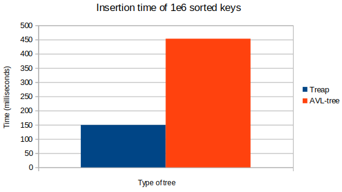
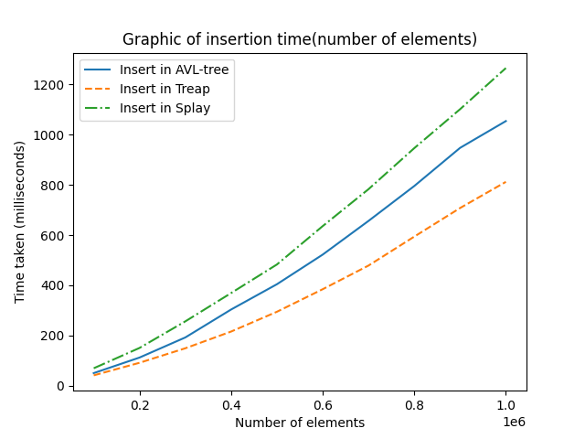
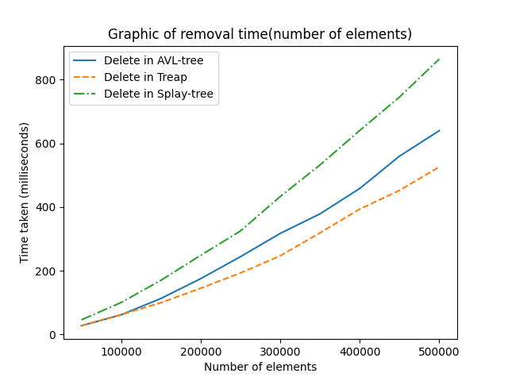
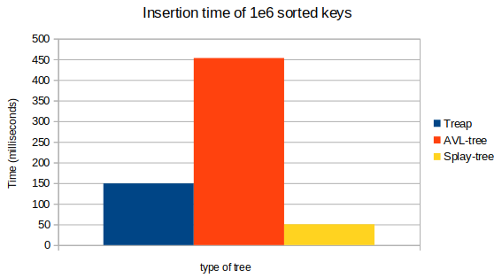
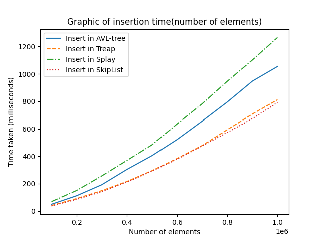
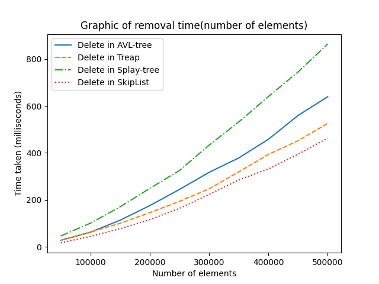

<h1 align="center">Привет, я <a href="https://t.me/Chin_chinless" target="_blank">Олег</a>
</h1>
<h4 align="center">Я автор лабораторной работы №6</h4>

# Тема: 
Сравнение времени работы различных деревьев поиска

# Цель:
Реализовать различные версии деревьев поиска, измерить время их работы и узнать, какая из них работает быстрее.

# Содержание:

1.  [Подготовка тестов для замеров времени](#подготовка-тестов-для-замеров-времени)
    1. [Оборудование для тестов](#оборудование-для-тестов)
    2. [Описание тестов](#описание-тестов)
2.  [Бинарное дерево поиска](#бинарное-дерево-поиска)
3.  [AVL-дерево](#avl-дерево)
4.  [Декартово дерево](#декартово-дерево)
5.  [Splay дерево](#splay-дерево)
6.  [SkipList](#skiplist)
7.  [Вывод](#вывод)

# Подготовка тестов для замеров времени

### Оборудование для тестов 

**Процессор**: AMD Ryzen 7 5800H 3.22 Ghz
**ОЗУ**: 16 Гб
**ОС**: Linux Ubuntu 22.04.4 LTS
**Компилятор**: cc (Ubuntu 11.4.0-1ubuntu1~22.04) 11.4.0

### Описание тестов

Для запуска тестов нужно ввести следующие команды:

```
git clone git@github.com:Ch1n-ch1nless/MiptLabs.git -b "Laboratory_work#6"  # скопировать ветку с гитхаба
cd MiptLabs/Laba6                                                           # перейти в папку с файлами
make test_generate                                                          # запустить генерацию тестов
```

Далее появится папка: `Tests`, в ней будут файлы, в которых записаны ключей:
10 файлов с случайными ключами с "100000.in" до "1000000.in" с шагом = 100000. И 2 файла "sorted_100000.in" и "sorted_1000000.in", в них находятся отсортированное множество ключей.

Все деревья прогоняются через тесты с файлами и замеряются время работы программы. 

# Бинарное дерево поиска

**Бинарное дерево поиска** - это структура данных, которая позволяет находить элементы из упорядоченного множества. Оно обладает следующим свойством: если $x$ — узел бинарного дерева с ключом $k$, то все узлы в левом поддереве должны иметь ключи, меньшие $k$, а в правом поддереве большие $k$.

Данное дерево не обладает ни какой балансировки, и оно при определенных данных может превратиться в "бамбук", то есть высота дерева будет $= n$.
Картинка, как выглядит бамбук:


Рассмотрим, как быстро работает BST:

| Тип операции  | Время работы со случайным множеством ключей   | Время работы с отсортированным множеством ключей  |
|:-------------:|:---------------------------------------------:|:-------------------------------------------------:|
|   Вставка     |          $61,80$ миллисекунд                  |             $31,24$ миллисекунд                   |
|   Удаление    |         $7189,23$ миллисекунд                 |            $3329,55$ миллисекунд                  |

BST работает с отсортированным множеством ключей в 100 раз медленнее, чем со случайным множеством ключей. Это объясняется легко, так при отсортированном множестве BST превращается в бамбук, и соответственно, вставка и удаление работает не за $O(h)$, а за $O(n)$.

**Итог:** Использовать BST - не самая лучшая идея, так как очень просто замедлить в 100 раз программу.

# AVL дерево

**AVL-дерево** - это сбалансированное бинарное дерево поиска, которое сохраняет следующее свойство:
***для каждой его вершины высота её двух поддеревьев различается не более чем на 1.***

Благодаря этому свойству, AVL-дерево не превратиться в бамбук, а всегда будет иметь высоту $h = O(logN)$. Проверим, действительно ли AVL-дерево быстрее, чем BST.

| Дерево    | Время вставки $10^5$ случайных элементов  |   Время удаления $5 \cdot 10^4$ случайных элементов   |
|:---------:|:-----------------------------------------:|:-----------------------------------------------------:|
|   BST     |       $61,80$ миллисекунд                 |       $31,24$ миллисекунд                             |
|   AVL     |       $49,78$ миллисекунд                 |       $27,63$ миллисекунд                             |

Для случайного набора элементов AVL работает быстрее, чем BST, но не значительно, рассмотрим дополнительно время на отсортированном множестве ключей.

| Дерево    | Время вставки $10^5$ отсортированных элементов    | Время удаления $5 \cdot 10^4$ отсортированных элементов   |
|:---------:|:-------------------------------------------------:|:---------------------------------------------------------:|
|   BST     |       $7189,23$ миллисекунд                       |           $3329,55$ миллисекунд                           |
|   AVL     |       $32.83$ миллисекунд                         |           $13.23$ миллисекунд                             |   

Разница очень сильно заметна, так как AVL работает быстрее в $\approx 220$ раз, чем BST!

**Итог:** AVL-дерево работает в разы лучше, чем BST. Поэтому в дальнейших исследованиях рассмотрение BST бессмысленно.

# Декартово дерево

**Декартово дерево** - это структура данных, объединяющая в себе пары (ключ, приоритет), по приоритетам строится бинарная куча, а по ключам - бинарное дерево поиска. 

В отличие от AVL-дерева, декартово дерево не использует балансировку, так как балансировка происходит за счёт приоритетов.

Асимптотически операция вставки и удаления = $O(logN)$. Так же как и у AVL-дерева $O(logN)$. Проверим на сколько отличаются они?





Как видим из графиков на случайном множестве ключей, декартово дерево показывает лучше результат. Я считаю, что это происходит из-за того, что AVL-дерево тратит время на балансировку дерева, после каждой операции дополнительно, а декартово нет, так как в операциях Split и Merge уже заложен нужный баланс из приоритетов.

Посмотрим на время выполнения вставки и удаления при сортированном множестве ключей:



Из графика видно, что на отсортированном массиве ключей декартово дерево работает быстрее в $\approx 3$ раза! 

**Итог:** Декартово дерево работает быстрее, чем AVL-дерево, так как не тратит лишнее время на балансировку дерева.

# Splay дерево

**Splay дерево** - это бинарное дерево поиска, принадлежащее к классу «саморегулирующихся деревьев», которые поддерживают необходимый баланс ветвления дерева, чтобы обеспечить выполнение операций поиска, добавления и удаления за $O(logN)$. 

Основное свойство дерева состоит в том, что оно обеспечивает быстрый доступ к тем данным, которые запрашивались недавно. Для этого дерево выполняет операцию *Splay* после каждого запроса. Данное свойство является и плюсом, и минусом, так как если запрашивать очень далекие друг от друга данные, то дерево будет работать медленно, а если данные расположены рядом, то очень быстро.

Проверим работоспособность дерева на случайном массиве ключей:





Так как ключ разные, то дереву нужно залезать довольно глубоко для поиска элементов, и постоянно делать операцию Splay.

Рассмотрим на отсортированном наборе ключей:



Так ключи расположены близко, то дерево не уходит в глубину для поиска элементов и за счёт этого делает все запросы быстрее, чем Декартово дерево!

**Итог:** Splay-дерево работает быстрее остальных деревьев, если мы заранее знаем, что запрашиваемые данные лежат друг с другом, однако если такой грантии нет, то splay-дерево показывает себя хуже остальных деревьев.

# SkipList

**SkipList** - это вероятностная структура данных, основанная на нескольких параллельных отсортированных связных с эффективностью, сравнимой с двоичным деревом.

В SkiplList поиск работает в среднем за $O(logN)$, проверим на сколько данная структура работает быстрее, чем деревья:





Как видим, действительно, SkipList работает быстрее, чем деревья на массиве случайных ключей.

Проверим на массиве отсортированных ключей:


Результаты хуже, чем у остальных, но SkipList работает быстрее, чем AVL-дерево

**Итог**: SkipList - хорошая альтернатива деревьям поиска, работает быстрее на случайном наборе ключей, но на отсортированном хуже

# Вывод

Из всех деревьев, которые сравнивались, лучше всего себя показала Декартово дерево, так как оно меньше всего балансирует себя после каждой операции, в то время, как остальные тратят на это лишнее время.

Однако, если известно, что часто будут запрашиваться данные, которые находятся рядом друг с другом, то будет выигрывать Splay-дерево, так оно предоставляет быстрый доступ к данным, которые запрашивались недавно.

Ещё стоит отметить, что SkipList - это хорошая альтернатива деревьям поиска, которая работает быстрее них, но не всегда, зависит от распределения данных.