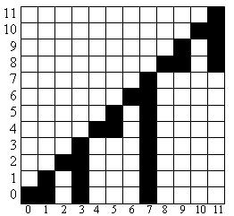
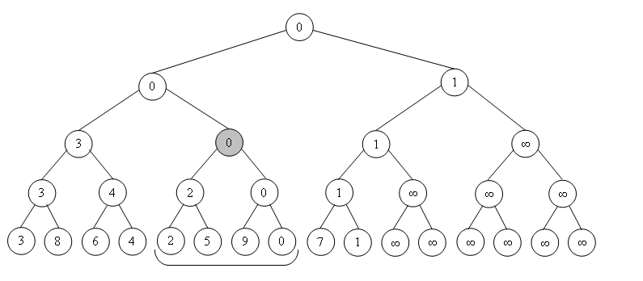

<h1 align="center">Привет, я <a href="https://t.me/Chin_chinless" target="_blank">Олег</a>
</h1>
<h4 align="center">Я автор лабораторной работы №7</h4>

# Тема: 
Сравнение времени работы дерево Фенвика, дерево отрезков и разреженная таблица.

# Цель:
Выяснить, что быстрее дерево Фенвика или дерево отрезков, узнать, какая реализация разреженной таблицы лучше!

# Содержание:

1.  [Подготовка тестов для замера](#подготовка-тестов-для-замера)
    1. [Оборудование для тестов](#оборудование-для-тестов)
    2. [Описание тестов](#описание-тестов)
2.  [Дерево Фенвика v/s Дерево отрезков](#дерево-фенвика-vs-дерево-отрезков)
    1.  [Дерево Фенвика](#дерево-фенвика)
    2.  [Дерево отрезков](#дерево-отрезков)
    3.  [Сравнение деревьев](#сравнение-деревьев)
    4.  [Итог](#итог)
3.  [Сравнение различных реализаций разреженной таблицы](#сравнение-различных-реализаций-разреженной-таблицы)
    1.  [Теоретическая справка](#теоретическая-справка)
    2.  [Первая версия](#первая-версия)
    3.  [Вторая версия](#вторая-версия)
    4.  [Итог](#итог-1)
4.  [Вывод](#вывод)

# Подготовка тестов для замера

### Оборудование для тестов

**Процессор**: AMD Ryzen 7 5800H 3.22 Ghz                   \
**ОЗУ**: 16 Гб                                              \
**ОС**: Linux Ubuntu 22.04.4 LTS                            \
**Компилятор**: cc (Ubuntu 11.4.0-1ubuntu1~22.04) 11.4.0    \

### Описание тестов

Команда для генерации тестов:

```
git clone git@github.com:Ch1n-ch1nless/MiptLabs.git     # Скопировать репозиторий
cd Laba7                                                # Перейти в папку с исходниками
make test_generate                                      # Сгенерировать тесты
```

Далее в папке `Tests` будут файлы:          \
`array.in`      -- файл с $10^6$ целыми числами
`requests.in`   -- файл с $10^6$ запросами левой границы и правой границы

# Дерево Фенвика v/s Дерево отрезков

### Дерево Фенвика

**Дерево Фенвика** - это структура данных, требующая $O(n)$ памяти и позволяющая эффективно за $O(log(n))$ выполнять следующие операции:
    1. изменять значение любого элемента в массиве,
    2. выполнять некоторую ассоциативную, коммутативную, обратимую операцию ∘ на отрезке $[i,j]$.

Вкратце, данная структура представляет собой массив $T$, который cостоит из $n$ элементов: $T[i] = \displaystyle\sum_{k=F(i)}^{i} a[i]$, где $i = 0, \dots ,n$ и $F(i) = i$ & $i + 1$, где & - логическая операция "И".


Картинка, которая показывает, какие суммы хранит дерево Фенвика: \
По горизонтали $T[i]$, по вертикали $a[i]$.



Всего, есть 2 операции:

1. Update:
```
Update(int i, int delta)
{
    while (i < n)
    {
        t[i] += delta
        i = i | (i + 1)
    }
} 
```
2. GetSum:
```
GetSum(int index)
{
    result = 0

    while (i >= 0)
    {
        result += t[i]
        i = (i & (i + 1)) - 1;
    }
}
```

Обе эти операции работают за $O(log(n))$. Так как в числе $n$ находится $\approx log(n)$ бит.

### Дерево отрезков

**Дерево отрезков** - это структура данных, которая позволяет за асимптотику $O(log(n))$ реализовать любые операции, определяемые на множестве, на котором данная операция ассоциативна, и существует нейтральный элемент относительно этой операции.

Как выглядит дерево отрезков на минимуме:



Дерево отрезков поддерживает 2 операции:

1. GetSum
``` C
int GetSum(int v, int tl, int tr, int l, int r) 
{
	if (l > r)
		return 0;
	if (l == tl && r == tr)
		return t[v];
	int tm = (tl + tr) / 2;
	return GetSum(v*2, tl, tm, l, min(r,tm)) + GetSum(v*2+1, tm+1, tr, max(l,tm+1), r);
}
```

2. Update
``` C
void update (int v, int tl, int tr, int pos, int new_val) {
	if (tl == tr)
		t[v] = new_val;
	else {
		int tm = (tl + tr) / 2;
		if (pos <= tm)
			update (v*2, tl, tm, pos, new_val);
		else
			update (v*2+1, tm+1, tr, pos, new_val);
		t[v] = t[v*2] + t[v*2+1];
	}
}
```

Данные 2 операции работают за $O(log(n))$.  

### Сравнение деревьев

Асимптотически дерево отрезков работает так же как и Фенвик, однако вопрос стоит в константе. Проведем измерения!
Измерения проводились при закрытии посторонних вкладок, ноутбук был на зарядке.

|   Номер замера    |  Время работы FenwickTree |   Время работы SegmentTable       |
|:-----------------:|:-------------------------:|:---------------------------------:|
|   1               |       71.63 ms            |       314.20 ms                   |
|   2               |       71.18 ms            |       314.55 ms                   |
|   3               |       71.09 ms            |       314.91 ms                   |
|   4               |       71.84 ms            |       313.74 ms                   |
|   5               |       71.05 ms            |       316.12 ms                   |

Итоговый результат:

|   FenwickTree         |   SegmentTree         |
|:---------------------:|:---------------------:|
|   71.36 \pm 0.32 ms   |   314.70 \pm 0.81 ms  |

Как видно из результатов, имеем, что дерево Фенвика быстрее дерева отрезков в $\approx 4.4$ раза! 

### Итог
Построение дерева Фенвика требует память, совпадающую с размером массива, в то время как дерево отрезков в худшем требует в $4$ раза больше памяти, чем оригинальный массив. Дополнительно, дерево Фенвика реализуется нерекурсивно при помощи цикла, и на каждом шаге обрабатывает не более двух вершин. Дерево отрезков же реализовано с использованием рекурсии при обработке запроса, и на каждом шаге возможно два рекурсивных вызова. Таким образом на каждом уровне дерева производится обработка до $4$ вершин. При этом за счет рекурсии эта обработка не одновременна, а значит обращение к памяти вызывает значительную задержку. Из-за рекурсивных вызовов и обработки большего количества вершин дерево отрезков замедляется в несколько раз.

# Сравнение различных реализаций разреженной таблицы

### Теоретическая справка

**Разреженная таблица** - это структура данных, позволяющая отвечать на запросы минимума или максимума на отрезке за $O(1)$ с препроцессингом за $O(NlogN)$.

Вкратце, разреженная таблица - это двухмерный массив, однако нюансы хранения далее:

### Первая версия

Двухмерный массив $ST$ - это массив массивов размера $logN$, а внутренние массивы размера $N$.

$ST[j][i] = min(a[i], a[i+1], \dots, a[i + 2^j - 1]),$ $j \in [0, logN]$.

Построение задаётся следующей рекурсивной формулой:
\[
\begin{equation*}
ST[j][i] = 
 \begin{cases}
   min(ST[j-1][i], ST[j-1][i + 2^{j-1}]) &\text{if $j > 0$}\\
   a[i] &\text{if $j = 0$}
 \end{cases}
\end{equation*}
\]

Поиск минимума на отрезке $[l, r]$:
$$k = \lfloor log(r - l + 1) \rfloor$$
$$answer = min(ST[k][l], ST[k][r - 2^k + 1])$$

### Вторая версия

Двухмерный массив $ST$ - это массив массивов размера $N$, а внутренние массивы размера $logN$.

$ST[i][j] = min(a[i], a[i+1], \dots, a[i + 2^j - 1]),$ $j \in [0, logN]$.

Построение задаётся следующей рекурсивной формулой:
\[
\begin{equation*}
ST[j][i] = 
 \begin{cases}
   min(ST[i][j-1], ST[i + 2^{j-1}][j-1]) &\text{if $j > 0$}\\
   a[i] &\text{if $j = 0$}
 \end{cases}
\end{equation*}
\]

Поиск минимума на отрезке $[l, r]$:
$$k = \lfloor log(r - l + 1) \rfloor$$
$$answer = min(ST[l][k], ST[r - 2^k + 1][k])$$

### Сравнение 

Выглядит, что обе версии должны работать одинаково, проверим правда ли это?

|   Номер замера    |   Время работы первой версии  |   Вторая версия   |
|:-----------------:|:-----------------------------:|:-----------------:|
|   1               |   46.36 ms                    |   112.70 ms       |
|   2               |   45.30 ms                    |   112.64 ms       |
|   3               |   45.99 ms                    |   113.61 ms       |
|   4               |   45.88 ms                    |   112.21 ms       |
|   5               |   46.04 ms                    |   111.37 ms       |

Итоговый результат:

|   Время работы первой версии  |   Время работы второй версии  |
|:-----------------------------:|:-----------------------------:|
|   45.91 \pm 0.35ms            |   112.51 \pm 0.73 ms          |

Имеем, что первая версия работает быстрее в $\approx 2.45$ раза!

### Итог

Вариант 1 работает быстрее за счет более оптимальной работы с памятью. В процессе работы алгоритма мы выбираем одну из строк, после чего, находясь в одном массиве выбираем два элемента. Во втором случае нам требуется взять элементы из двух различных массивов, что приводит к необходимости обращения к двум далеким друг от друга местам в памяти. Задержка из-за загрузки данных в кеш является основным фактором, замедляющим работу программы. Таким образом, вариант 1 работает в 2,45 раза быстрее за счет в два раза меньшего количества обращений к памяти.

# Вывод

Имеем, что дерево Фенвика работает в разы быстрее, чем дерево отрезков, однако дерево Фенвика имеет ограничение следующее: оно поддерживает только обратимые операции, а дерево отрезков нет, например дерево отрезков позволяет считать произведение на отрезке, а в Фенвике с нулем будут проблемы.

Так же в разреженной таблице стоит использовать первую версию для реализации.
