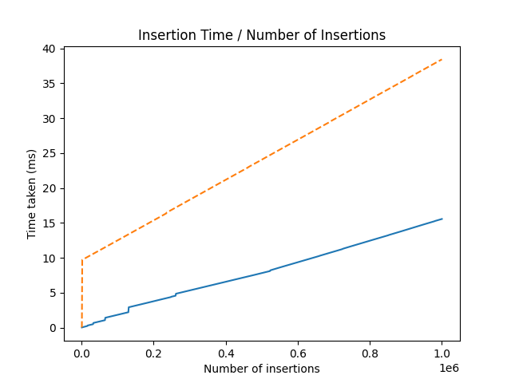

<h1 align="center">Привет, я <a href="https://t.me/Chin_chinless" target="_blank">Олег</a>
</h1>
<h4 align="center">Я автор лабараторной работы №2</h4>

В этой лабараторной работе были проведены следующие тесты:

<h4 align="left"> Тест1 </h4>
Сначала проводим 10^6 операций 'push'. Потом удаляем половину элементов и пушим ещё четверть - останется 750000 элементов. Повторяем эти операции, пока не останется в стеке меньше 100000 элементов.

<h4 align="left"> Тест2 </h4>
Пушим 10^6 интов, потом 100 раз удалем 10000 элементов и добавляем столько же. Далее как в первом тесте проводим 9 итераций удаления-вставки и снова 100 раз удаляем 10000 элементов и добавляем столько же.

<h4 align="left"> Тест3 </h4>
Доводим размер стека до 10^6. Потом проводим миллион операций 'push' или 'pop', в зависимости от того, какое случайное число выпало. 

<h3 align="center"> Результаты тестов! </h3>
Теперь запишем в табличку результаты тестов:

| 	   |    Тест1    |    Тест2    |    Тест3    |
|----------|-------------|-------------|-------------|
| DynArr   | 32.712000ms | 49.086000ms | 29.243000ms |
| SLList   | 87.365000ms | 119.40300ms | 40.012000ms |

Время указано в милисекундах. DynArr - время работы стека, реализованного на динамическом массиве. SLList - время работы стека, реализованного на односвязном списке.

Видим, что стек на динамическом массиве гораздо быстрее работает, чем стек на односвязном списке!

<h4 align="left"> Тест4 </h4>

График работы стека:
На динамическом массиве -- синяя сплошная линия
На односвязном списке   -- оранжевая штрихованная линия

<h2 align="center"> Вывод </h2>

Как видим, стек на динамическом массиве работает гораздо быстрее, чем стек на односвязном списке. Где-то в 2-3 раза. Поэтому в задачах, когда нам важна общая скорость операций, то лучше использовать стек на динамическом массиве. Однако, у стека на динамическом массиве имеет свои минусы! Его операции 'push' и 'pop' работают за амортизированный O(1), то есть мы видим небольшие сильные скачки на графике, которые показывают, что произошел 'realloc'. А у односвязного списка таких скачков нет. Если нам не нужны скачки, то лучше стек на односвязном списке.

