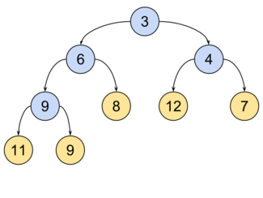
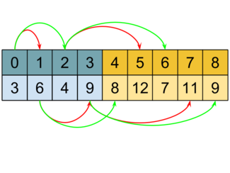

<h1 align="center">Привет, я <a href="https://t.me/Chin_chinless" target="_blank">Олег</a>
</h1>
<h4 align="center">Я автор лабораторной работы №4</h4>

# Тема:
"Исследование времени построения кучи за $O(N)$ и за $O(NlogN)$"

# Цель:
"Построить кучи за $O(N)$ и $O(NlogN)$"

# Содержание

1. [Теоретическая справка](#теоретическая-справка)
2. [Алгоритм построения за $O(NlogN)$](#алгоритм-построения-за-onlogn)
    - [Доказательство асимптотики $O(NlogN)$](#доказательство-асимптотики-onlogn)
3. [Алгоритм построения за $O(N)$](#алгоритм-построения-за-on)
    - [Доказательство асимптотики $O(N)$](#доказательство-асимптотики-on)
4. [Измерение времени работы](#измерение-времени-работы)
5. [Вывод](#вывод)

# Теоретическая справка



**Бинарная куча**(пирамида) - это подвешенное бинарное дерево, обладающее следующими свойствами:
    1. Значения в каждой вершине не меньше, чем значения в потомках
    2. На i-ом ярусе не больше $2^i$ вершин
    3. Последний слой заполнен слева направо



В памяти куча хранится, как массив, где левый ребенок имеет индекс $2i+1$, а правый - $2i+2$.

Операции, сохраняющие свойства кучи:

**SuftUp**:
1. Сравниваем элемент с родителем, если родитель больше, то поменяем их местами.
2. Продолжим выполнять 1-ый пункт, пока родитель не станет корнем или меньше равен значению элемента

Реализация на Си:
``` C
void SiftUp (BinaryHeap* heap, size_t index)
{
    assert((heap != NULL) && "Pointer to \'heap\' is NULL!!!\n");
    assert((heap->data != NULL) && "Pointer to \'heap->data\' is NULL!!!\n");
    assert((index <= heap->size) && "Incorrect value of index!\n");

    size_t parent = 0;

    while (index != 0)
    {
        parent = GetParent(index);

        if (heap->data[parent] > heap->data[index])
        {
            SwapNodes(heap->data + parent, heap->data + index);
            index = parent;
        }
        else
        {
            break;
        }
    }
}
```

Асимптотика $O(logN)$. Так как начало может быть от самого дальнего элемента в куче, а расстояние между ним и корнем - это высота кучи, учитывая ещё, что на i-ом ярусе не больше $2^i$ вершим, то соответственно высота = $O(logN)$ $\Rightarrow$ асимптотика **SiftUp** := $O(logN)$.


**SiftDown**:
1. Сравниваем элемент с детьми, если оба ребенка меньше, то поменяем местами с наименьшим из детей.
2. Продолжим выполнение 1-ого пункта, пока элемент не окажется меньше своих детей или не окажется листом.

Реализация на Си:
``` C
void SiftDown(BinaryHeap* heap, size_t index)
{
    assert((heap != NULL) && "Pointer to \'heap\' is NULL!!!\n");
    assert((heap->data != NULL) && "Pointer to \'heap->data\' is NULL!!!\n");
    assert((index <= heap->size) && "Incorrect value of index!\n");

    size_t left_child  = GetLeftChild(index);
    size_t right_child = GetRightChild(index);
    size_t min_index   = index;

    if (left_child < heap->size && heap->data[left_child] < heap->data[min_index])
    {
        min_index = left_child;
    }

    if (right_child < heap->size && heap->data[right_child] < heap->data[min_index])
    {
        min_index = right_child;
    }

    if (min_index != index)
    {
        SwapNodes(heap->data + min_index, heap->data + index);
        SiftDown(heap, min_index);
    }
}
```

Асимптотика $O(logN)$. Рассуждения аналогичны, как с SiftUp.

# Алгоритм построения за O(NlogN)

Для построения на $O(NlogN)$, достаточно реализовать вставку элемента в кучу за $O(logN)$.

Напишем код вставки на Си:
``` C
//[in]:     heap        = указатель на бинарную кучу
//[in]:     new_node    = элемент, который хотим вставить
//[out]:    OK / ERROR  = вставка произошла успешно / неуспешно.
int BinaryHeapInsert(BinaryHeap* heap, node_t new_node)
{
    assert((heap != NULL) && "Pointer to \'heap\' is NULL!!!\n");
    assert((heap->data != NULL) && "Pointer to \'heap->data\' is NULL!!!\n");

    if (heap->size == heap->capacity)
    {
        if (ReallocUp(heap) == ERROR)
        {
            assert(0 && "ERROR! Program can not allocate memory!!!\n");
            return ERROR;
        }
    }

    heap->data[heap->size] = new_node;
    heap->size++;

    SiftUp(heap, heap->size-1);

    return OK;
}
```

Вставить элемент можно лишь на последний ярус, но при этом может потеряться свойство кучи. Для восстановления свойства кучи вызывает функцию *SiftUp*. Так как в *SiftUp* происходит не более $h$ операций, где $h$ - высота кучи и $h = O(logN)$ $\Rightarrow$ асимптотика **BinaryHeapInsert** := $O(logN)$.

Теперь для построения достаточно произвести $n$ вставок.

Код на Си:
``` C
int BinaryHeapBuildForNlogN(BinaryHeap* heap, node_t* buffer_with_nodes, size_t buffer_size)
{
    assert((heap != NULL) && "Pointer to \'heap\' is NULL!!!\n");
    assert((heap->data != NULL) && "Pointer to \'heap->data\' is NULL!!!\n");

    for (size_t i = 0; i < buffer_size; i++)
    {
        BinaryHeapInsert(heap, buffer_with_nodes[i]);
    }

    return OK;
}
```

## Доказательство асимптотики O(NlogN)

В прошлом пункте мы доказали, что вставка в кучу происходит за $O(logN)$. \
Соответственно, построение кучи - это вставка в кучу $n$ элементов. Асимптотика $T(N) = N \times O(logN) = O(NlogN)$ $\Rightarrow$
$T(N) = O(NlogN)$. ПОБЕДА!!! 🥳🥳


# Алгоритм построения за O(N)


## Доказательство асимптотики O(N)

# Измерение времени работы

# Вывод